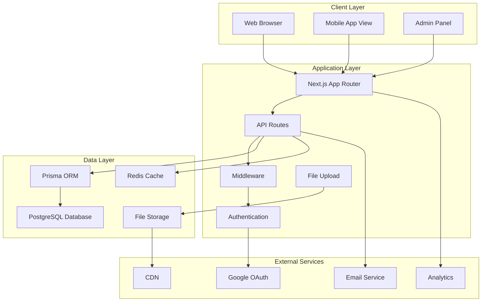
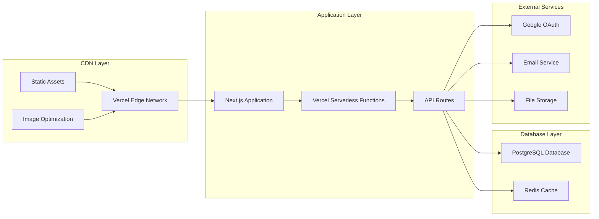
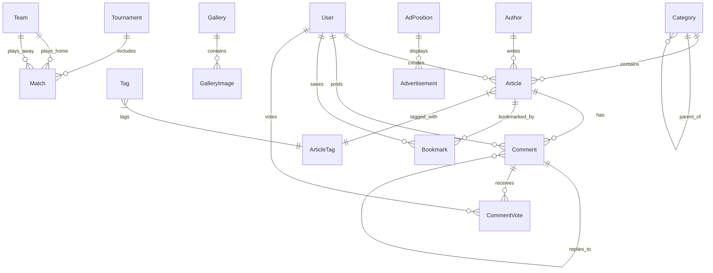

# Design Document: Professional News Portal

## Overview

The Professional News Portal is a modern, full-featured news website built with Next.js 14+, React 18+, TypeScript, PostgreSQL, and Prisma ORM. The system provides a comprehensive news publishing platform with multi-language support (Nepali primary, English secondary), dynamic theming (light/dark modes), and complete administrative control over site configuration.

The architecture follows a modern web application pattern with server-side rendering, static generation, and client-side interactivity. The system is designed to handle high traffic loads while maintaining excellent performance and user experience across all devices.

### Key Features
- **Multi-language Support**: Native Nepali language support with English as secondary
- **Dynamic Configuration**: All site elements configurable from admin panel
- **Theme System**: Light/dark mode with smooth transitions
- **Rich Content Management**: Advanced article editor with media support
- **User Engagement**: Comment system with voting, bookmarks, and social features
- **Sports Integration**: Live scores and tournament management
- **Video Content**: OK Reels short-form video feature
- **Advertisement System**: Comprehensive ad management and tracking
- **Security**: Enterprise-grade security with comprehensive protection
- **Performance**: Optimized for Core Web Vitals and accessibility

## Architecture

### System Architecture

The system follows a modern three-tier architecture:



### Technology Stack

#### Frontend
- **Next.js 14+**: App Router with SSR, SSG, and ISR
- **React 18+**: Functional components with hooks
- **TypeScript**: Strict mode for type safety
- **Tailwind CSS**: Utility-first styling with custom theme system
- **Tiptap**: Rich text editor for article content
- **SWR**: Data fetching and caching
- **React Hot Toast**: Notification system

#### Backend
- **Next.js API Routes**: RESTful API endpoints
- **Prisma ORM**: Type-safe database operations
- **NextAuth.js**: Authentication and session management
- **Zod**: Input validation and schema definition
- **bcryptjs**: Password hashing
- **DOMPurify**: XSS protection

#### Database
- **PostgreSQL**: Primary database with JSONB support
- **Redis**: Caching and rate limiting (optional)
- **Prisma Migrations**: Version-controlled schema changes

#### Security
- **CSRF Protection**: Token-based protection
- **Rate Limiting**: API endpoint protection
- **Input Validation**: Comprehensive validation with Zod
- **File Upload Security**: Magic byte validation and sanitization
- **Session Security**: HTTP-only, secure cookies

### Deployment Architecture



## Components and Interfaces

### Core Components

#### 1. Article Management System
```typescript
interface Article {
  id: string
  title: string
  title_en?: string
  slug: string
  content: string
  content_en?: string
  excerpt: string
  excerpt_en?: string
  featured_image?: string
  category_id: string
  author_id: string
  status: 'draft' | 'published' | 'archived'
  published_at?: Date
  view_count: number
  ai_summary?: string
  seo_title?: string
  seo_description?: string
  og_image?: string
  created_at: Date
  updated_at: Date
}

interface ArticleService {
  create(data: CreateArticleInput): Promise<Article>
  update(id: string, data: UpdateArticleInput): Promise<Article>
  publish(id: string): Promise<Article>
  findBySlug(slug: string): Promise<Article | null>
  findMany(filters: ArticleFilters): Promise<PaginatedResult<Article>>
  incrementViewCount(id: string): Promise<void>
}
```

#### 2. Category and Tag System
```typescript
interface Category {
  id: string
  name: string
  name_en?: string
  slug: string
  description?: string
  color: string
  parent_id?: string
  sort_order: number
  created_at: Date
}

interface Tag {
  id: string
  name: string
  slug: string
  created_at: Date
}

interface CategoryService {
  create(data: CreateCategoryInput): Promise<Category>
  findHierarchy(): Promise<CategoryTree[]>
  findBySlug(slug: string): Promise<Category | null>
}
```

#### 3. User Authentication System
```typescript
interface User {
  id: string
  name: string
  email: string
  password_hash?: string
  avatar?: string
  role: 'admin' | 'editor' | 'author' | 'reader'
  email_verified: boolean
  oauth_provider?: 'google'
  oauth_id?: string
  created_at: Date
  updated_at: Date
}

interface AuthService {
  register(data: RegisterInput): Promise<User>
  login(email: string, password: string): Promise<AuthResult>
  loginWithOAuth(provider: string, profile: OAuthProfile): Promise<AuthResult>
  verifyEmail(token: string): Promise<boolean>
  resetPassword(token: string, newPassword: string): Promise<boolean>
}
```

#### 4. Comment System
```typescript
interface Comment {
  id: string
  article_id: string
  user_id: string
  parent_id?: string
  content: string
  status: 'pending' | 'approved' | 'rejected' | 'spam'
  likes: number
  dislikes: number
  created_at: Date
}

interface CommentService {
  create(data: CreateCommentInput): Promise<Comment>
  vote(commentId: string, userId: string, type: 'like' | 'dislike'): Promise<void>
  moderate(commentId: string, status: CommentStatus): Promise<Comment>
  findByArticle(articleId: string): Promise<CommentTree[]>
}
```

#### 5. Media Management System
```typescript
interface MediaFile {
  id: string
  filename: string
  original_name: string
  mime_type: string
  size: number
  width?: number
  height?: number
  variants?: MediaVariant[]
  uploaded_by: string
  created_at: Date
}

interface MediaService {
  upload(file: File, userId: string): Promise<MediaFile>
  generateVariants(mediaId: string): Promise<MediaVariant[]>
  delete(mediaId: string): Promise<void>
  findMany(filters: MediaFilters): Promise<PaginatedResult<MediaFile>>
}
```

### API Interface Design

#### RESTful API Structure
```typescript
// Article endpoints
GET    /api/articles              // List articles with pagination
POST   /api/articles              // Create new article (auth required)
GET    /api/articles/[slug]       // Get article by slug
PUT    /api/articles/[id]         // Update article (auth required)
DELETE /api/articles/[id]         // Delete article (auth required)
POST   /api/articles/[id]/publish // Publish article (auth required)

// Category endpoints
GET    /api/categories            // List all categories
POST   /api/categories            // Create category (auth required)
GET    /api/categories/[slug]     // Get category with articles
PUT    /api/categories/[id]       // Update category (auth required)

// Comment endpoints
GET    /api/comments              // List comments for article
POST   /api/comments              // Create comment (auth required)
POST   /api/comments/[id]/vote    // Vote on comment (auth required)
PUT    /api/comments/[id]/moderate // Moderate comment (admin required)

// Authentication endpoints
POST   /api/auth/register         // User registration
POST   /api/auth/login            // User login
POST   /api/auth/logout           // User logout
POST   /api/auth/forgot-password  // Password reset request
POST   /api/auth/reset-password   // Password reset confirmation
POST   /api/auth/verify-email     // Email verification

// Media endpoints
POST   /api/media/upload          // Upload media file (auth required)
GET    /api/media                 // List media files (auth required)
DELETE /api/media/[id]            // Delete media file (auth required)

// Settings endpoints
GET    /api/settings              // Get site settings
PUT    /api/settings              // Update site settings (admin required)
```

#### Response Format
```typescript
interface APIResponse<T> {
  success: boolean
  data?: T
  error?: {
    message: string
    code: string
    details?: any
  }
  pagination?: {
    page: number
    limit: number
    total: number
    totalPages: number
  }
}
```

### Frontend Component Architecture

#### Component Hierarchy
```
App
├── Layout
│   ├── Header
│   │   ├── Navigation
│   │   ├── MegaMenu
│   │   ├── SearchBar
│   │   ├── LanguageSwitcher
│   │   └── ThemeToggle
│   ├── BreakingNewsTicker
│   └── Footer
├── Pages
│   ├── HomePage
│   │   ├── HeroSection
│   │   ├── NewsSection
│   │   ├── SportsSection
│   │   ├── VideoSection
│   │   └── Sidebar
│   ├── ArticlePage
│   │   ├── ArticleHeader
│   │   ├── ArticleContent
│   │   ├── CommentSection
│   │   └── RelatedArticles
│   ├── CategoryPage
│   └── SearchPage
├── Admin
│   ├── Dashboard
│   ├── ArticleEditor
│   ├── CategoryManager
│   ├── UserManager
│   └── SettingsPanel
└── Common
    ├── ArticleCard
    ├── CommentCard
    ├── Modal
    ├── Toast
    └── LoadingSpinner
```

## Data Models

### Database Schema

```prisma
// User and Authentication
model User {
  id              String    @id @default(cuid())
  name            String
  email           String    @unique
  password_hash   String?
  avatar          String?
  role            Role      @default(READER)
  email_verified  Boolean   @default(false)
  oauth_provider  String?
  oauth_id        String?
  theme           String    @default("light")
  language        String    @default("ne")
  created_at      DateTime  @default(now())
  updated_at      DateTime  @updatedAt
  
  // Relations
  articles        Article[]
  comments        Comment[]
  bookmarks       Bookmark[]
  comment_votes   CommentVote[]
  
  @@map("users")
}

model Author {
  id          String    @id @default(cuid())
  name        String
  name_en     String?
  email       String    @unique
  avatar      String?
  bio         String?
  bio_en      String?
  role        String    @default("reporter")
  social_links Json?
  is_active   Boolean   @default(true)
  created_at  DateTime  @default(now())
  updated_at  DateTime  @updatedAt
  
  // Relations
  articles    Article[]
  
  @@map("authors")
}

// Content Management
model Article {
  id              String      @id @default(cuid())
  title           String
  title_en        String?
  slug            String      @unique
  content         String
  content_en      String?
  excerpt         String
  excerpt_en      String?
  featured_image  String?
  category_id     String
  author_id       String
  status          ArticleStatus @default(DRAFT)
  is_featured     Boolean     @default(false)
  is_breaking     Boolean     @default(false)
  published_at    DateTime?
  view_count      Int         @default(0)
  ai_summary      String?
  reading_time    Int?
  seo_title       String?
  seo_description String?
  og_image        String?
  created_at      DateTime    @default(now())
  updated_at      DateTime    @updatedAt
  
  // Relations
  category        Category    @relation(fields: [category_id], references: [id])
  author          Author      @relation(fields: [author_id], references: [id])
  tags            ArticleTag[]
  comments        Comment[]
  bookmarks       Bookmark[]
  
  @@map("articles")
}

model Category {
  id          String    @id @default(cuid())
  name        String
  name_en     String?
  slug        String    @unique
  description String?
  color       String    @default("#c62828")
  parent_id   String?
  sort_order  Int       @default(0)
  is_active   Boolean   @default(true)
  created_at  DateTime  @default(now())
  updated_at  DateTime  @updatedAt
  
  // Relations
  parent      Category? @relation("CategoryHierarchy", fields: [parent_id], references: [id])
  children    Category[] @relation("CategoryHierarchy")
  articles    Article[]
  
  @@map("categories")
}

model Tag {
  id         String      @id @default(cuid())
  name       String      @unique
  slug       String      @unique
  created_at DateTime    @default(now())
  
  // Relations
  articles   ArticleTag[]
  
  @@map("tags")
}

model ArticleTag {
  article_id String
  tag_id     String
  
  // Relations
  article    Article @relation(fields: [article_id], references: [id], onDelete: Cascade)
  tag        Tag     @relation(fields: [tag_id], references: [id], onDelete: Cascade)
  
  @@id([article_id, tag_id])
  @@map("article_tags")
}

// Comment System
model Comment {
  id         String        @id @default(cuid())
  article_id String
  user_id    String
  parent_id  String?
  content    String
  status     CommentStatus @default(PENDING)
  likes      Int           @default(0)
  dislikes   Int           @default(0)
  created_at DateTime      @default(now())
  updated_at DateTime      @updatedAt
  
  // Relations
  article    Article       @relation(fields: [article_id], references: [id], onDelete: Cascade)
  user       User          @relation(fields: [user_id], references: [id], onDelete: Cascade)
  parent     Comment?      @relation("CommentReplies", fields: [parent_id], references: [id])
  replies    Comment[]     @relation("CommentReplies")
  votes      CommentVote[]
  
  @@map("comments")
}

model CommentVote {
  id         String   @id @default(cuid())
  comment_id String
  user_id    String
  type       VoteType
  created_at DateTime @default(now())
  
  // Relations
  comment    Comment  @relation(fields: [comment_id], references: [id], onDelete: Cascade)
  user       User     @relation(fields: [user_id], references: [id], onDelete: Cascade)
  
  @@unique([comment_id, user_id])
  @@map("comment_votes")
}

// Sports System
model Tournament {
  id         String   @id @default(cuid())
  name       String
  name_en    String?
  sport_type String
  is_active  Boolean  @default(true)
  sort_order Int      @default(0)
  created_at DateTime @default(now())
  updated_at DateTime @updatedAt
  
  // Relations
  matches    Match[]
  
  @@map("tournaments")
}

model Team {
  id         String   @id @default(cuid())
  name       String
  name_en    String?
  logo       String?
  country    String?
  created_at DateTime @default(now())
  
  // Relations
  home_matches Match[] @relation("HomeTeam")
  away_matches Match[] @relation("AwayTeam")
  
  @@map("teams")
}

model Match {
  id            String      @id @default(cuid())
  tournament_id String
  home_team_id  String
  away_team_id  String
  home_score    Int?
  away_score    Int?
  status        MatchStatus @default(UPCOMING)
  match_date    DateTime
  venue         String?
  created_at    DateTime    @default(now())
  updated_at    DateTime    @updatedAt
  
  // Relations
  tournament    Tournament  @relation(fields: [tournament_id], references: [id])
  home_team     Team        @relation("HomeTeam", fields: [home_team_id], references: [id])
  away_team     Team        @relation("AwayTeam", fields: [away_team_id], references: [id])
  
  @@map("matches")
}

// Media System
model MediaFile {
  id            String         @id @default(cuid())
  filename      String
  original_name String
  mime_type     String
  size          Int
  width         Int?
  height        Int?
  alt_text      String?
  uploaded_by   String
  created_at    DateTime       @default(now())
  
  // Relations
  uploader      User           @relation(fields: [uploaded_by], references: [id])
  variants      MediaVariant[]
  
  @@map("media_files")
}

model MediaVariant {
  id           String    @id @default(cuid())
  media_file_id String
  variant_type String    // thumbnail, medium, large
  filename     String
  width        Int
  height       Int
  size         Int
  created_at   DateTime  @default(now())
  
  // Relations
  media_file   MediaFile @relation(fields: [media_file_id], references: [id], onDelete: Cascade)
  
  @@map("media_variants")
}

// OK Reels System
model Reel {
  id          String   @id @default(cuid())
  title       String
  title_en    String?
  slug        String   @unique
  thumbnail   String
  video_url   String
  duration    Int      // in seconds
  view_count  Int      @default(0)
  is_active   Boolean  @default(true)
  created_at  DateTime @default(now())
  updated_at  DateTime @updatedAt
  
  @@map("reels")
}

// Photo Gallery System
model Gallery {
  id          String        @id @default(cuid())
  title       String
  title_en    String?
  slug        String        @unique
  description String?
  description_en String?
  category_id String?
  is_active   Boolean       @default(true)
  created_at  DateTime      @default(now())
  updated_at  DateTime      @updatedAt
  
  // Relations
  category    Category?     @relation(fields: [category_id], references: [id])
  images      GalleryImage[]
  
  @@map("galleries")
}

model GalleryImage {
  id         String   @id @default(cuid())
  gallery_id String
  image_url  String
  caption    String?
  caption_en String?
  sort_order Int      @default(0)
  created_at DateTime @default(now())
  
  // Relations
  gallery    Gallery  @relation(fields: [gallery_id], references: [id], onDelete: Cascade)
  
  @@map("gallery_images")
}

// Advertisement System
model AdPosition {
  id          String @id @default(cuid())
  alias       String @unique
  description String
  page        String // homepage, article, category, etc.
  device_type String // desktop, mobile, all
  created_at  DateTime @default(now())
  
  // Relations
  ads         Advertisement[]
  
  @@map("ad_positions")
}

model Advertisement {
  id           String      @id @default(cuid())
  position_id  String
  title        String
  content_type AdType
  content      String      // HTML, image URL, or script
  target_url   String?
  start_date   DateTime
  end_date     DateTime
  priority     Int         @default(0)
  impressions  Int         @default(0)
  clicks       Int         @default(0)
  is_active    Boolean     @default(true)
  created_at   DateTime    @default(now())
  updated_at   DateTime    @updatedAt
  
  // Relations
  position     AdPosition  @relation(fields: [position_id], references: [id])
  
  @@map("advertisements")
}

// Breaking News System
model BreakingNews {
  id         String    @id @default(cuid())
  title      String
  title_en   String?
  article_id String?
  expires_at DateTime?
  is_active  Boolean   @default(true)
  created_at DateTime  @default(now())
  updated_at DateTime  @updatedAt
  
  // Relations
  article    Article?  @relation(fields: [article_id], references: [id])
  
  @@map("breaking_news")
}

// User Engagement
model Bookmark {
  id         String   @id @default(cuid())
  user_id    String
  article_id String
  created_at DateTime @default(now())
  
  // Relations
  user       User     @relation(fields: [user_id], references: [id], onDelete: Cascade)
  article    Article  @relation(fields: [article_id], references: [id], onDelete: Cascade)
  
  @@unique([user_id, article_id])
  @@map("bookmarks")
}

// Site Configuration
model SiteSettings {
  key        String   @id
  value      Json
  updated_at DateTime @updatedAt
  
  @@map("site_settings")
}

// Analytics
model PageView {
  id         String   @id @default(cuid())
  page_url   String
  article_id String?
  user_id    String?
  ip_address String
  user_agent String
  referrer   String?
  created_at DateTime @default(now())
  
  // Relations
  article    Article? @relation(fields: [article_id], references: [id])
  user       User?    @relation(fields: [user_id], references: [id])
  
  @@map("page_views")
}

// Enums
enum Role {
  ADMIN
  EDITOR
  AUTHOR
  READER
}

enum ArticleStatus {
  DRAFT
  PUBLISHED
  ARCHIVED
}

enum CommentStatus {
  PENDING
  APPROVED
  REJECTED
  SPAM
}

enum VoteType {
  LIKE
  DISLIKE
}

enum MatchStatus {
  UPCOMING
  LIVE
  COMPLETED
  CANCELLED
}

enum AdType {
  IMAGE
  HTML
  SCRIPT
}
```

### Data Relationships



## Testing Strategy

### Testing Approach

The testing strategy follows a comprehensive approach covering unit tests, integration tests, and end-to-end tests to ensure system reliability and correctness.

#### Unit Testing
- **Framework**: Vitest with React Testing Library
- **Coverage Target**: ≥ 80% code coverage
- **Scope**: Individual functions, components, and utilities
- **Focus Areas**:
  - Utility functions (date conversion, text processing)
  - Validation schemas (Zod schemas)
  - Helper modules (API clients, formatters)
  - React components (isolated testing)

#### Integration Testing
- **Framework**: Vitest with Supertest for API testing
- **Scope**: API endpoints, database operations, service integrations
- **Focus Areas**:
  - API endpoint request/response behavior
  - Database CRUD operations
  - Authentication flows
  - File upload functionality
  - Email service integration (mocked)

#### End-to-End Testing
- **Framework**: Playwright
- **Browser**: Chromium (primary), Firefox, Safari (WebKit)
- **Scope**: Complete user workflows and critical paths
- **Focus Areas**:
  - User registration and authentication
  - Article creation and publishing workflow
  - Comment system functionality
  - Search and navigation
  - Responsive design across viewports
  - Theme and language switching
  - Admin panel operations

### Test Categories

#### 1. Authentication Tests
```typescript
describe('Authentication System', () => {
  test('user registration with email verification')
  test('user login with email/password')
  test('OAuth login with Google')
  test('password reset flow')
  test('session management and expiration')
  test('role-based access control')
})
```

#### 2. Content Management Tests
```typescript
describe('Article Management', () => {
  test('create article with rich content')
  test('publish article workflow')
  test('article slug generation and uniqueness')
  test('category and tag assignment')
  test('featured image upload and optimization')
  test('SEO metadata generation')
})
```

#### 3. User Interaction Tests
```typescript
describe('Comment System', () => {
  test('post comment on article')
  test('reply to existing comment')
  test('vote on comments (like/dislike)')
  test('comment moderation workflow')
  test('nested comment display')
})
```

#### 4. Multi-language Tests
```typescript
describe('Internationalization', () => {
  test('default Nepali language display')
  test('language switching functionality')
  test('Nepali date formatting')
  test('Unicode text input and display')
  test('search in Nepali content')
})
```

#### 5. Performance Tests
```typescript
describe('Performance', () => {
  test('homepage load time < 2 seconds')
  test('article page load time < 1.5 seconds')
  test('image optimization and lazy loading')
  test('Core Web Vitals compliance')
  test('bundle size optimization')
})
```

#### 6. Security Tests
```typescript
describe('Security', () => {
  test('XSS prevention in user content')
  test('CSRF protection on state-changing operations')
  test('SQL injection prevention')
  test('file upload security validation')
  test('rate limiting enforcement')
  test('authentication token security')
})
```

#### 7. Accessibility Tests
```typescript
describe('Accessibility', () => {
  test('keyboard navigation support')
  test('screen reader compatibility')
  test('color contrast compliance')
  test('ARIA labels and semantic HTML')
  test('focus management')
})
```

### Testing Configuration

#### Playwright Configuration
```typescript
// playwright.config.ts
export default defineConfig({
  testDir: './tests/e2e',
  fullyParallel: true,
  forbidOnly: !!process.env.CI,
  retries: process.env.CI ? 2 : 0,
  workers: process.env.CI ? 1 : undefined,
  reporter: 'html',
  use: {
    baseURL: 'http://localhost:3000',
    trace: 'on-first-retry',
    screenshot: 'only-on-failure',
  },
  projects: [
    {
      name: 'chromium',
      use: { ...devices['Desktop Chrome'] },
    },
    {
      name: 'firefox',
      use: { ...devices['Desktop Firefox'] },
    },
    {
      name: 'webkit',
      use: { ...devices['Desktop Safari'] },
    },
    {
      name: 'Mobile Chrome',
      use: { ...devices['Pixel 5'] },
    },
    {
      name: 'Mobile Safari',
      use: { ...devices['iPhone 12'] },
    },
  ],
})
```

#### Vitest Configuration
```typescript
// vitest.config.ts
export default defineConfig({
  plugins: [react()],
  test: {
    environment: 'jsdom',
    setupFiles: ['./tests/setup.ts'],
    coverage: {
      provider: 'v8',
      reporter: ['text', 'json', 'html'],
      threshold: {
        global: {
          branches: 80,
          functions: 80,
          lines: 80,
          statements: 80,
        },
      },
    },
  },
})
```

### Continuous Integration

#### GitHub Actions Workflow
```yaml
name: CI/CD Pipeline

on:
  push:
    branches: [main, develop]
  pull_request:
    branches: [main]

jobs:
  test:
    runs-on: ubuntu-latest
    steps:
      - uses: actions/checkout@v4
      - uses: actions/setup-node@v4
        with:
          node-version: '18'
          cache: 'npm'
      
      - name: Install dependencies
        run: npm ci
      
      - name: Run unit tests
        run: npm run test:unit
      
      - name: Run integration tests
        run: npm run test:integration
      
      - name: Run E2E tests
        run: npm run test:e2e
      
      - name: Upload coverage reports
        uses: codecov/codecov-action@v3
```

This comprehensive testing strategy ensures that all critical functionality is thoroughly tested, providing confidence in system reliability and enabling safe continuous deployment.

## Error Handling

### Error Handling Strategy

The system implements comprehensive error handling at multiple layers to ensure graceful degradation and excellent user experience even when things go wrong.

#### Client-Side Error Handling

##### React Error Boundaries
```typescript
interface ErrorBoundaryState {
  hasError: boolean
  error?: Error
  errorInfo?: ErrorInfo
}

class GlobalErrorBoundary extends Component<PropsWithChildren, ErrorBoundaryState> {
  constructor(props: PropsWithChildren) {
    super(props)
    this.state = { hasError: false }
  }

  static getDerivedStateFromError(error: Error): ErrorBoundaryState {
    return { hasError: true, error }
  }

  componentDidCatch(error: Error, errorInfo: ErrorInfo) {
    console.error('Error caught by boundary:', error, errorInfo)
    // Log to error monitoring service
    this.logErrorToService(error, errorInfo)
  }

  render() {
    if (this.state.hasError) {
      return <ErrorFallback error={this.state.error} />
    }
    return this.props.children
  }
}
```

##### API Error Handling
```typescript
interface APIError {
  message: string
  code: string
  status: number
  details?: any
}

class APIClient {
  async request<T>(endpoint: string, options?: RequestInit): Promise<T> {
    try {
      const response = await fetch(endpoint, {
        ...options,
        headers: {
          'Content-Type': 'application/json',
          ...options?.headers,
        },
      })

      if (!response.ok) {
        const errorData = await response.json()
        throw new APIError(
          errorData.error?.message || 'Request failed',
          errorData.error?.code || 'UNKNOWN_ERROR',
          response.status,
          errorData.error?.details
        )
      }

      return await response.json()
    } catch (error) {
      if (error instanceof APIError) {
        throw error
      }
      
      // Network or parsing errors
      throw new APIError(
        'Network error occurred',
        'NETWORK_ERROR',
        0,
        { originalError: error.message }
      )
    }
  }
}
```

##### Form Validation Errors
```typescript
interface FormErrors {
  [field: string]: string[]
}

const useFormValidation = <T>(schema: ZodSchema<T>) => {
  const [errors, setErrors] = useState<FormErrors>({})

  const validate = (data: unknown): data is T => {
    try {
      schema.parse(data)
      setErrors({})
      return true
    } catch (error) {
      if (error instanceof ZodError) {
        const formErrors: FormErrors = {}
        error.errors.forEach((err) => {
          const field = err.path.join('.')
          if (!formErrors[field]) {
            formErrors[field] = []
          }
          formErrors[field].push(err.message)
        })
        setErrors(formErrors)
      }
      return false
    }
  }

  return { errors, validate, clearErrors: () => setErrors({}) }
}
```

#### Server-Side Error Handling

##### API Route Error Handler
```typescript
interface APIError extends Error {
  statusCode: number
  code: string
  details?: any
}

class ValidationError extends APIError {
  constructor(message: string, details?: any) {
    super(message)
    this.name = 'ValidationError'
    this.statusCode = 400
    this.code = 'VALIDATION_ERROR'
    this.details = details
  }
}

class AuthenticationError extends APIError {
  constructor(message: string = 'Authentication required') {
    super(message)
    this.name = 'AuthenticationError'
    this.statusCode = 401
    this.code = 'AUTHENTICATION_ERROR'
  }
}

class AuthorizationError extends APIError {
  constructor(message: string = 'Insufficient permissions') {
    super(message)
    this.name = 'AuthorizationError'
    this.statusCode = 403
    this.code = 'AUTHORIZATION_ERROR'
  }
}

const errorHandler = (error: Error, req: NextRequest): Response => {
  console.error('API Error:', error)

  // Log to monitoring service
  logErrorToMonitoring(error, {
    url: req.url,
    method: req.method,
    headers: Object.fromEntries(req.headers.entries()),
    timestamp: new Date().toISOString(),
  })

  if (error instanceof APIError) {
    return NextResponse.json(
      {
        success: false,
        error: {
          message: error.message,
          code: error.code,
          details: error.details,
        },
      },
      { status: error.statusCode }
    )
  }

  // Unexpected errors
  return NextResponse.json(
    {
      success: false,
      error: {
        message: 'Internal server error',
        code: 'INTERNAL_ERROR',
      },
    },
    { status: 500 }
  )
}
```

##### Database Error Handling
```typescript
class DatabaseService {
  async executeQuery<T>(operation: () => Promise<T>): Promise<T> {
    try {
      return await operation()
    } catch (error) {
      if (error instanceof Prisma.PrismaClientKnownRequestError) {
        switch (error.code) {
          case 'P2002':
            throw new ValidationError('Duplicate entry', {
              field: error.meta?.target,
            })
          case 'P2025':
            throw new NotFoundError('Record not found')
          case 'P2003':
            throw new ValidationError('Foreign key constraint failed')
          default:
            throw new DatabaseError(`Database error: ${error.message}`)
        }
      }
      
      if (error instanceof Prisma.PrismaClientValidationError) {
        throw new ValidationError('Invalid data provided')
      }

      throw new DatabaseError('Database operation failed')
    }
  }
}
```

#### Error Monitoring and Logging

##### Error Logging Service
```typescript
interface ErrorLog {
  id: string
  timestamp: Date
  level: 'error' | 'warn' | 'info'
  message: string
  stack?: string
  context?: any
  userId?: string
  sessionId?: string
}

class ErrorLogger {
  private static instance: ErrorLogger
  private logs: ErrorLog[] = []

  static getInstance(): ErrorLogger {
    if (!ErrorLogger.instance) {
      ErrorLogger.instance = new ErrorLogger()
    }
    return ErrorLogger.instance
  }

  log(level: ErrorLog['level'], message: string, error?: Error, context?: any) {
    const errorLog: ErrorLog = {
      id: generateId(),
      timestamp: new Date(),
      level,
      message,
      stack: error?.stack,
      context,
      userId: context?.userId,
      sessionId: context?.sessionId,
    }

    this.logs.push(errorLog)
    
    // Send to external monitoring service
    this.sendToMonitoring(errorLog)
    
    // Store in database for analysis
    this.persistLog(errorLog)
  }

  private async sendToMonitoring(log: ErrorLog) {
    try {
      // Send to Sentry, LogRocket, or similar service
      await fetch('/api/monitoring/error', {
        method: 'POST',
        headers: { 'Content-Type': 'application/json' },
        body: JSON.stringify(log),
      })
    } catch (error) {
      console.error('Failed to send error to monitoring service:', error)
    }
  }
}
```

#### User-Friendly Error Messages

##### Error Message Localization
```typescript
const errorMessages = {
  ne: {
    NETWORK_ERROR: 'इन्टरनेट जडान समस्या भयो। कृपया पुनः प्रयास गर्नुहोस्।',
    VALIDATION_ERROR: 'प्रविष्ट गरिएको जानकारी सही छैन।',
    AUTHENTICATION_ERROR: 'कृपया पहिले लगइन गर्नुहोस्।',
    AUTHORIZATION_ERROR: 'तपाईंलाई यो कार्य गर्ने अनुमति छैन।',
    NOT_FOUND: 'खोजिएको सामग्री फेला परेन।',
    INTERNAL_ERROR: 'सर्भर त्रुटि भयो। कृपया पछि प्रयास गर्नुहोस्।',
  },
  en: {
    NETWORK_ERROR: 'Network connection problem. Please try again.',
    VALIDATION_ERROR: 'The information provided is not valid.',
    AUTHENTICATION_ERROR: 'Please log in first.',
    AUTHORIZATION_ERROR: 'You do not have permission to perform this action.',
    NOT_FOUND: 'The requested content was not found.',
    INTERNAL_ERROR: 'Server error occurred. Please try again later.',
  },
}

const getErrorMessage = (code: string, language: string = 'ne'): string => {
  return errorMessages[language]?.[code] || errorMessages.en[code] || 'An error occurred'
}
```

##### Error Display Components
```typescript
interface ErrorDisplayProps {
  error: APIError
  onRetry?: () => void
  showDetails?: boolean
}

const ErrorDisplay: React.FC<ErrorDisplayProps> = ({ 
  error, 
  onRetry, 
  showDetails = false 
}) => {
  const { language } = useLanguage()
  const message = getErrorMessage(error.code, language)

  return (
    <div className="error-container bg-red-50 border border-red-200 rounded-lg p-4">
      <div className="flex items-center">
        <ExclamationTriangleIcon className="h-5 w-5 text-red-400" />
        <h3 className="ml-2 text-sm font-medium text-red-800">
          {language === 'ne' ? 'त्रुटि' : 'Error'}
        </h3>
      </div>
      
      <div className="mt-2">
        <p className="text-sm text-red-700">{message}</p>
        
        {showDetails && error.details && (
          <details className="mt-2">
            <summary className="text-xs text-red-600 cursor-pointer">
              {language === 'ne' ? 'विस्तृत जानकारी' : 'Details'}
            </summary>
            <pre className="mt-1 text-xs text-red-600 bg-red-100 p-2 rounded">
              {JSON.stringify(error.details, null, 2)}
            </pre>
          </details>
        )}
      </div>
      
      {onRetry && (
        <div className="mt-3">
          <button
            onClick={onRetry}
            className="text-sm bg-red-600 text-white px-3 py-1 rounded hover:bg-red-700"
          >
            {language === 'ne' ? 'पुनः प्रयास गर्नुहोस्' : 'Try Again'}
          </button>
        </div>
      )}
    </div>
  )
}
```

#### Custom Error Pages

##### 404 Not Found Page
```typescript
// app/not-found.tsx
export default function NotFound() {
  const { language } = useLanguage()
  
  return (
    <div className="min-h-screen flex items-center justify-center bg-gray-50">
      <div className="max-w-md w-full text-center">
        <div className="mb-8">
          <h1 className="text-9xl font-bold text-gray-300">404</h1>
        </div>
        
        <h2 className="text-2xl font-bold text-gray-900 mb-4">
          {language === 'ne' ? 'पृष्ठ फेला परेन' : 'Page Not Found'}
        </h2>
        
        <p className="text-gray-600 mb-8">
          {language === 'ne' 
            ? 'तपाईंले खोज्नुभएको पृष्ठ अवस्थित छैन।'
            : 'The page you are looking for does not exist.'
          }
        </p>
        
        <div className="space-y-3">
          <Link
            href="/"
            className="block w-full bg-primary text-white py-2 px-4 rounded hover:bg-primary-dark"
          >
            {language === 'ne' ? 'मुख्य पृष्ठमा जानुहोस्' : 'Go to Homepage'}
          </Link>
          
          <button
            onClick={() => window.history.back()}
            className="block w-full bg-gray-200 text-gray-800 py-2 px-4 rounded hover:bg-gray-300"
          >
            {language === 'ne' ? 'पछाडि जानुहोस्' : 'Go Back'}
          </button>
        </div>
      </div>
    </div>
  )
}
```

##### 500 Server Error Page
```typescript
// app/error.tsx
'use client'

interface ErrorPageProps {
  error: Error & { digest?: string }
  reset: () => void
}

export default function ErrorPage({ error, reset }: ErrorPageProps) {
  const { language } = useLanguage()
  
  useEffect(() => {
    // Log error to monitoring service
    console.error('Application error:', error)
  }, [error])

  return (
    <div className="min-h-screen flex items-center justify-center bg-gray-50">
      <div className="max-w-md w-full text-center">
        <div className="mb-8">
          <ExclamationTriangleIcon className="mx-auto h-16 w-16 text-red-500" />
        </div>
        
        <h2 className="text-2xl font-bold text-gray-900 mb-4">
          {language === 'ne' ? 'केही गलत भयो' : 'Something went wrong'}
        </h2>
        
        <p className="text-gray-600 mb-8">
          {language === 'ne'
            ? 'हामी यो समस्या समाधान गर्न काम गरिरहेका छौं।'
            : 'We are working to resolve this issue.'
          }
        </p>
        
        <div className="space-y-3">
          <button
            onClick={reset}
            className="block w-full bg-primary text-white py-2 px-4 rounded hover:bg-primary-dark"
          >
            {language === 'ne' ? 'पुनः प्रयास गर्नुहोस्' : 'Try Again'}
          </button>
          
          <Link
            href="/"
            className="block w-full bg-gray-200 text-gray-800 py-2 px-4 rounded hover:bg-gray-300"
          >
            {language === 'ne' ? 'मुख्य पृष्ठमा जानुहोस्' : 'Go to Homepage'}
          </Link>
        </div>
      </div>
    </div>
  )
}
```

#### Error Recovery Strategies

##### Retry Mechanisms
```typescript
interface RetryOptions {
  maxAttempts: number
  delay: number
  backoff: 'linear' | 'exponential'
}

class RetryableOperation {
  static async execute<T>(
    operation: () => Promise<T>,
    options: RetryOptions = { maxAttempts: 3, delay: 1000, backoff: 'exponential' }
  ): Promise<T> {
    let lastError: Error
    
    for (let attempt = 1; attempt <= options.maxAttempts; attempt++) {
      try {
        return await operation()
      } catch (error) {
        lastError = error as Error
        
        if (attempt === options.maxAttempts) {
          throw lastError
        }
        
        const delay = options.backoff === 'exponential' 
          ? options.delay * Math.pow(2, attempt - 1)
          : options.delay * attempt
          
        await new Promise(resolve => setTimeout(resolve, delay))
      }
    }
    
    throw lastError!
  }
}
```

##### Graceful Degradation
```typescript
const ArticleList: React.FC = () => {
  const [articles, setArticles] = useState<Article[]>([])
  const [loading, setLoading] = useState(true)
  const [error, setError] = useState<APIError | null>(null)

  useEffect(() => {
    const loadArticles = async () => {
      try {
        setLoading(true)
        const data = await RetryableOperation.execute(
          () => apiClient.get<Article[]>('/api/articles')
        )
        setArticles(data)
        setError(null)
      } catch (err) {
        setError(err as APIError)
        // Fallback to cached data if available
        const cachedArticles = getCachedArticles()
        if (cachedArticles.length > 0) {
          setArticles(cachedArticles)
        }
      } finally {
        setLoading(false)
      }
    }

    loadArticles()
  }, [])

  if (loading) {
    return <ArticleListSkeleton />
  }

  if (error && articles.length === 0) {
    return (
      <ErrorDisplay 
        error={error} 
        onRetry={() => window.location.reload()} 
      />
    )
  }

  return (
    <div>
      {error && (
        <div className="mb-4 p-3 bg-yellow-50 border border-yellow-200 rounded">
          <p className="text-sm text-yellow-800">
            {language === 'ne' 
              ? 'नवीनतम डेटा लोड गर्न सकिएन। पुराना डेटा देखाइएको छ।'
              : 'Could not load latest data. Showing cached content.'
            }
          </p>
        </div>
      )}
      
      <div className="grid gap-4">
        {articles.map(article => (
          <ArticleCard key={article.id} article={article} />
        ))}
      </div>
    </div>
  )
}
```

This comprehensive error handling strategy ensures that users receive helpful feedback when things go wrong, while providing developers with the information needed to diagnose and fix issues quickly.
## Correctness Properties

*A property is a characteristic or behavior that should hold true across all valid executions of a system-essentially, a formal statement about what the system should do. Properties serve as the bridge between human-readable specifications and machine-verifiable correctness guarantees.*

After analyzing the acceptance criteria, several properties are suitable for property-based testing. The following properties capture the essential correctness requirements that should hold universally across all valid inputs.

### Property Reflection

Before defining the final properties, I identified potential redundancy in the initial analysis:

- **Article Creation Properties**: Properties 1.1, 1.2, and 1.3 all test article CRUD operations but focus on different aspects (creation, updates, publishing). These provide unique validation value and should remain separate.
- **Slug Uniqueness Properties**: Properties 1.10 and 2.11 both test slug uniqueness but for different entities (articles vs categories/tags). These can be combined into a single comprehensive slug uniqueness property.
- **Authentication Properties**: Properties 3.1 and 3.2 test different aspects of authentication (registration vs login) and should remain separate.
- **Comment System Properties**: Properties 4.1, 4.3, and 4.4 test different aspects of commenting (creation, voting, vote toggling) and provide unique validation value.
- **Search Properties**: Properties 10.1 and 10.3 test different aspects of search (matching vs ranking) and should remain separate.
- **Theme Properties**: Properties 31.3 and 31.4 test different aspects of theming (application vs persistence) and should remain separate.

### Property 1: Article Creation Data Persistence

*For any* valid article data (title, content, excerpt, featured image, category, tags, author, status), when an admin creates an article, the system SHALL save all provided fields correctly in the database.

**Validates: Requirements 1.1**

### Property 2: Article Update Preservation

*For any* existing article and any valid update data, when an admin updates the article, the system SHALL apply all changes while preserving the original creation timestamp.

**Validates: Requirements 1.2**

### Property 3: Article Publishing State Transition

*For any* draft article, when an admin publishes it, the system SHALL set the status to published and record a publication timestamp.

**Validates: Requirements 1.3**

### Property 4: Image Variant Generation

*For any* valid image file, when uploaded as a featured image, the system SHALL generate responsive variants (thumbnail, medium, large) with appropriate dimensions.

**Validates: Requirements 1.4**

### Property 5: Universal Slug Uniqueness

*For any* content entity (article, category, tag), the generated slug SHALL be unique across the system and URL-safe (containing only alphanumeric characters, hyphens, and underscores).

**Validates: Requirements 1.10, 2.11**

### Property 6: Category Creation Data Persistence

*For any* valid category data (name, name_en, slug, description, color, sort_order), when an admin creates a category, the system SHALL save all provided fields correctly.

**Validates: Requirements 2.1**

### Property 7: User Registration with Password Hashing

*For any* valid email and password combination, when a user registers, the system SHALL create an account with the password hashed using bcrypt with salt rounds ≥ 10.

**Validates: Requirements 3.1, 17.1**

### Property 8: Authentication Session Creation

*For any* registered user with valid credentials, when they log in, the system SHALL create an authenticated session with proper session tokens.

**Validates: Requirements 3.2**

### Property 9: Comment Creation Data Persistence

*For any* authenticated user and valid comment content, when submitted on an article, the system SHALL save the comment with article_id, user_id, content, and timestamp.

**Validates: Requirements 4.1**

### Property 10: Comment Vote Counting

*For any* comment and vote type (like/dislike), when a user votes, the system SHALL increment the appropriate count (likes or dislikes) by exactly one.

**Validates: Requirements 4.3**

### Property 11: Comment Vote Toggling

*For any* comment that a user has already voted on, when they vote again with the same type, the system SHALL remove their vote, and when they vote with a different type, the system SHALL change their vote.

**Validates: Requirements 4.4**

### Property 12: Search Query Matching

*For any* search query and article collection, the search engine SHALL return only articles that contain the query terms in their title, content, or tags.

**Validates: Requirements 10.1**

### Property 13: Search Result Ranking

*For any* search results containing matches in different fields, the system SHALL rank articles with title matches higher than those with only content matches.

**Validates: Requirements 10.3**

### Property 14: SEO Metadata Uniqueness

*For any* page or article, the SEO system SHALL generate unique meta titles and descriptions that differ from other pages.

**Validates: Requirements 16.1**

### Property 15: Structured Data Completeness

*For any* published article, the SEO system SHALL generate JSON-LD structured data containing author, publication date, featured image, and publisher information.

**Validates: Requirements 16.5**

### Property 16: XSS Content Sanitization

*For any* user-generated content (comments, search queries), the XSS filter SHALL remove or escape all potentially dangerous HTML tags and JavaScript while preserving safe formatting.

**Validates: Requirements 17.4**

### Property 17: Theme Application Consistency

*For any* theme selection (light or dark), when a user toggles the theme, the system SHALL apply the theme consistently across all UI components site-wide.

**Validates: Requirements 31.3**

### Property 18: Theme Preference Persistence

*For any* theme preference, when set by a user, the system SHALL persist the preference in browser storage and restore it on subsequent visits.

**Validates: Requirements 31.4**

### Property 19: Language Switching Completeness

*For any* UI state, when a user switches to a different language, ALL UI strings SHALL change to the selected language immediately and consistently.

**Validates: Requirements 32.3**

### Property 20: Dynamic Configuration Propagation

*For any* site configuration change (logo, name, footer content), when updated by an admin, ALL components displaying that configuration SHALL reflect the change immediately.

**Validates: Requirements 33.15**

These properties provide comprehensive coverage of the system's core correctness requirements and will be implemented as property-based tests with a minimum of 100 iterations each to ensure robust validation across diverse input scenarios.